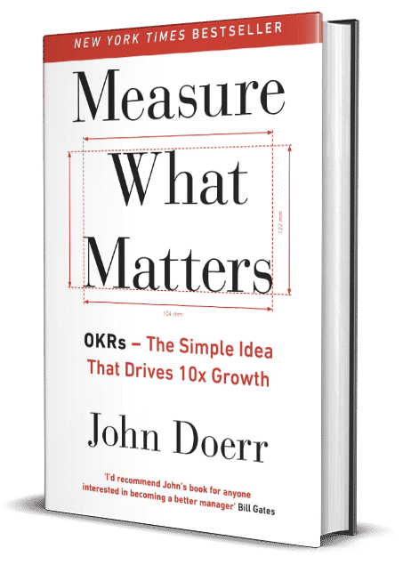

OKR stands for Objective & Key Results, meaning “objectives and key results.” In the OKR model, there are approaches for defining and tracking goals and evaluating their results, usually on a quarterly (three-month) and annual basis.

The [OKR technique](/en/docs/archive/%D8%A7%D9%87%D8%AF%D8%A7%D9%81-%D9%88-%D9%86%D8%AA%D8%A7%DB%8C%D8%AC-%DA%A9%D9%84%DB%8C%D8%AF%DB%8Cokr/), whose idea was first raised in 1970 by Andy Grove at Intel, is about managing a company’s actions and measuring goals on the basis of objectives and key results. Twenty-nine years later, in 1999, John Doerr introduced it, with a few changes, at Google.

Using the OKR method, Google was able to grow from 40 employees to 6,000, and it has used this method to advance its organizational goals for about 20 years.

Besides Intel and Google, LinkedIn, Twitter, and [Spotify](https://www.mural.co/blog/spotify-okr-planning) also use OKRs. It is not only digital and online service companies that use the OKR system; companies such as Walmart, Target, and The Guardian also manage their organizational goals with this model.

## What is OKR and how does it work?

An OKR is a list of 3 to 5 highest-priority objectives for each person, and each of those objectives has 3 to 5 measurable sub-goals and key results. Each key result includes a progress score from 0–100% or 0 to 1.0, which shows how far the result has been achieved.

In this method there is a leader or manager who guides and leads the team. An acceptable score for each OKR is between 0.6 and 0.7. If people always score 1, it means the goals were not ambitious enough. On the other hand, if people always score in the 0 to 0.3 range, it means the goals were not defined reasonably and were impossible to reach. Defining these measures reasonably and through discussion is one of the main success factors of the OKR method.

## **Benefits of OKRs:**

- Intellectual discipline takes shape in the organization. The main goals are flattened.
- Everyone in the organization is told what matters. As a result, communication becomes correct and clear.
- Metrics are created for measuring the organization’s progress, and on that basis it becomes clear how far you are from the organization’s main goals.
- With the OKR model, the effort that happens in the organization is focused. In practice, it keeps everyone in the organization together.
