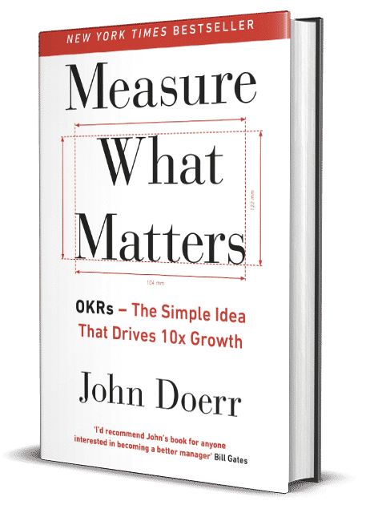

OKR مخفف عبارت Objective & Key Results بوده و به معنای “اهداف و نتایج کلیدی” است. در مدل او کی آر، راهکارهایی برای تعریف و پیگیری اهداف و ارزیابی نتایج آن‌‌ها معمولاً به صورت فصلی (۳‌ماهه) و سالانه پیگیری می‌شود.

[تکنیک OKR](https://theminiceo.ir/product-articles/%d8%a7%d9%87%d8%af%d8%a7%d9%81-%d9%88-%d9%86%d8%aa%d8%a7%db%8c%d8%ac-%da%a9%d9%84%db%8c%d8%af%db%8cokr/) که ایده‌ی آن برای اولین بار در سال ۱۹۷۰ توسط اندی گراو (Andy Grove) در شرکت اینتل مطرح شد، مدیریت اقدام‌های شرکت و اندازه گیری اهداف بر مبنای اهداف و نتایج کلیدی است. ۲۹ سال بعد در سال ۱۹۹۹ جان دوئر (John Doerr) در کمپانی بزرگ گوگل با اندکی تغییرات آن را معرفی کرد.

شرکت گوگل با استفاده از روش OKR توانست تعداد کارمندان خود را از ۴۰ نفر به ۶۰۰۰ نفر افزایش دهد و حدود ۲۰ سال است که از این روش جهت پیشبرد اهداف سازمان خود استفاده می‌کند.

علاوه بر اینتل و گوگل، لینکدین، توئیتر و [اسپاتیفای](https://www.mural.co/blog/spotify-okr-planning) هم از OKR، استفاده می‌کنند. البته این‌طور نیست که تنها شرکت‌های ارائه‌دهنده سرویس‌های دیجیتالی و آنلاین از سیستم OKR استفاده ‌کنند؛ شرکت‌هایی مانند والمارت، تارگت و گاردین هم با این مدل اهداف سازمانی خود را مدیریت می‌کنند.

## OKR چیست و چطور کار می‌کند؟

OKR شامل لیستی از ۳ تا ۵ هدف با بالاترین اولویت برای هر شخص است که هر کدام از این اهداف، دارای ۳ تا ۵ زیر هدف و نتیجه کلیدی قابل اندازه‌گیری است. هر نتیجه کلیدی شامل یک نمره‌ی پیشرفت است که از (( ۰-۱۰۰٪ یا ۰ تا ۱٫۰ )) بوده و میزان حصول به نتیجه را نشان می‌دهد.

در این روش یک رهبر و یا مدیر وجود دارد که تیم را هدایت و راهبری می‌کند. نمره قابل قبول برای هر OKR بین ۰٫۶ تا ۰٫۷ است. اگر افراد همواره نمره ۱ بگیرند؛ بدین معناست که به اندازه کافی جاه‌طلبانه نبوده است. از طرف دیگر اگر افراد همواره نمراتی در بازه ۰ تا ۰٫۳ بگیرند؛ به این معنا است که منطقی تعریف نشده و دستیابی به آن غیر ممکن بوده است. تعریف منطقی و مشورتی این معیارها یکی از عوامل اصلی موفقیت متد OKR است.

## **مزایایی OKR:**

- نظم فکری در سازمان شکل می­‌گیرد. اهداف اصلی مسطح می­‌شوند.
- به تمامی افراد سازمان گفته می‌شود که چه چیزهایی مهم است. درنتیجه ارتباطات به ­طور صحیح و واضح برقرار می­‌شود.
- شاخص­‌هایی برای اندازه­‌گیری پیشرفت سازمان ایجاد می­‌گردد که بر اساس آن‌ها مشخص می‌شود که تا چه اندازه از اهداف اصلی­ سازمان فاصله داریم.
- با مدل OKR تلاش­‌هایی که در سازمان اتفاق می‌­افتد، متمرکز می‌شوند. درواقع کل افراد سازمان را در کنار هم نگه می­‌دارد.
