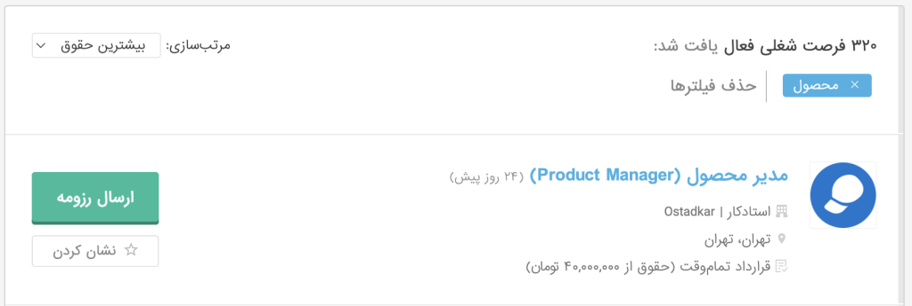

Did you know there are 321 product-related job openings on Jobinja?

People usually say that becoming a product manager requires a lot of work experience, familiarity with many concepts, and taking many courses.

But that is not the only path.

In this workshop you prepare, as quickly as possible, to enter the job market so you can wrestle with product challenges in practice.

Topics we cover in this intensive two-hour workshop:

1. Finding your personal talents and skills

3. Preparing a suitable résumé

5. Reviewing product-interview questions and interview tactics

7. Planning for the first three months on the job

* * *

Register through the section below. After you register, the workshop link will be sent to you. If you want the TheMiniCEO team to support you until you are hired, register for the special course.
