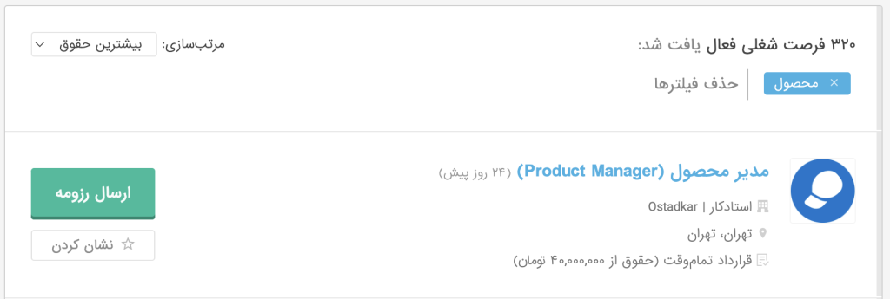
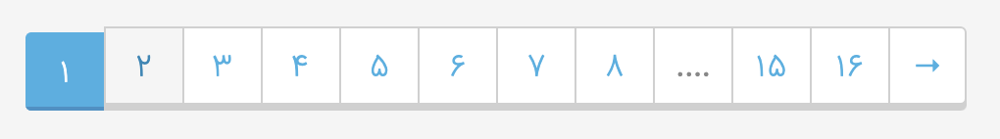
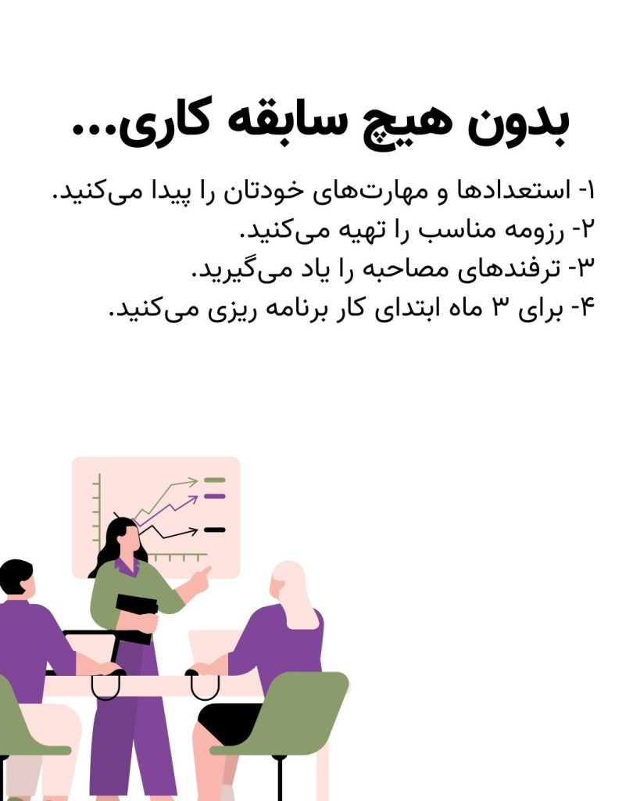

آیا می‌دانستید ۳۲۱ فرصت شغلی مرتبط با محصول در جابینجا وجود دارد؟

معمولا این طور می‌گویند که مدیر محصول شدن نیاز به تجربه کاری بالا، آشنایی با مفاهیم مختلف و شرکت در دوره‌های مختلف دارد.

اما این تنها مسیر نیست.

در این کارگاه به سریع‌ترین روش ممکن خود را آماده ورود به بازار کار می‌کنید تا در عمل با چالش‌های محصولی دست و پنجه نرم کنید.

موضوعاتی که در این کارگاه فشرده ۲ ساعته به آن می‌پردازیم:

1. پیدا کردن استعدادها و مهارت‌های شخصی

3. تهیه رزومه مناسب

5. بررسی سوالات مصاحبه محصولی و ترفندهای مصاحبه

7. برنامه ریزی برای ۳ ماه ابتدای کار

* * *

برای ثبت نام از طریق بخش زیر اقدام کنید. پس از ثبت نام لینک شرکت در کارگاه برای شما ارسال خواهد شد. اگر تمایل دارید تیم مدیرعامل کوچک تا زمان استخدام به شما پشتیبانی دهد دوره ویژه را ثبت نام کنید.
