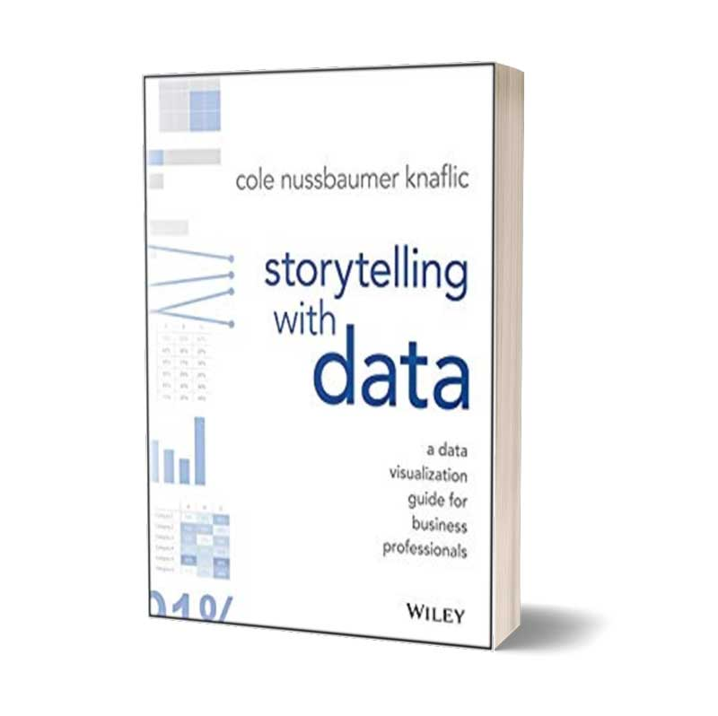
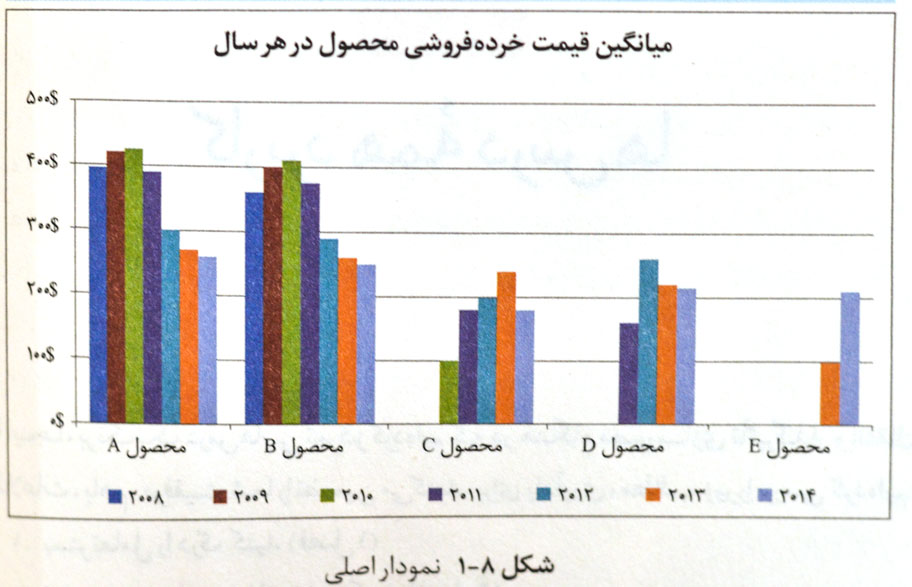
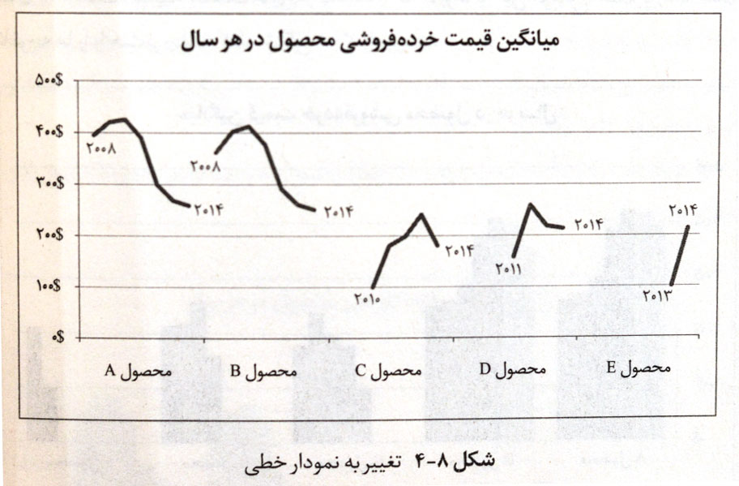

Presenting data, figures, and numbers, and putting together presentation files, has always been hard and time-consuming. We usually use a handful of charts at random, without being sure that the chart actually carries the meaning we want to the audience. *Storytelling with Data* helps you know your audience and, in line with that audience and your goal, prepare the best display and story for your data.

If we spend ten or twenty hours gathering data, why not spend the same amount of time (or even more) building slides that are compelling and effective?

In *Storytelling with Data*, Cole Nussbaumer Knaflic assumes that you already have a set of numbers and that you need to prepare a very powerful, effective presentation.

She talks about the importance of color, points out the problems with cluttered charts, helps you steer the audience’s mind toward your message, and tries to remind you of some of the most important principles of design.

But is the chart above as clear as the one below—drawn with thought, analysis, and ideation—and does it carry its message as clearly and transparently?

So our suggestion is this: if “presenting charts and numbers is decisive in your work and business,” go to this book. For example, you may have a startup and want to present a compelling report to venture investors, or you may have spent months in a business-intelligence team and several months of work is about to be presented in a few slides.

> The content of the book helps the reports you prepare from data be purposeful and understandable for the audience.

We also suggest you not miss the companion site for the book ([Storytellingwithdata](http://www.storytellingwithdata.com/)). The site has [a strong blog](http://www.storytellingwithdata.com/blog) and [a valuable podcast series](http://www.storytellingwithdata.com/podcast) that can teach you a great deal. The Storytelling with Data challenges section ([SWD Challenge](http://www.storytellingwithdata.com/swdchallenge)) also gives you exercises and challenges so you can test and try your data-visualization skill.

## Buy Storytelling with Data

[Buy the print edition on Digikala](https://affstat.adro.co/click/0c16f374-504e-4077-8cc4-7c231e4870bc)

You can also download *Storytelling with Data* (original edition) from the section below:
