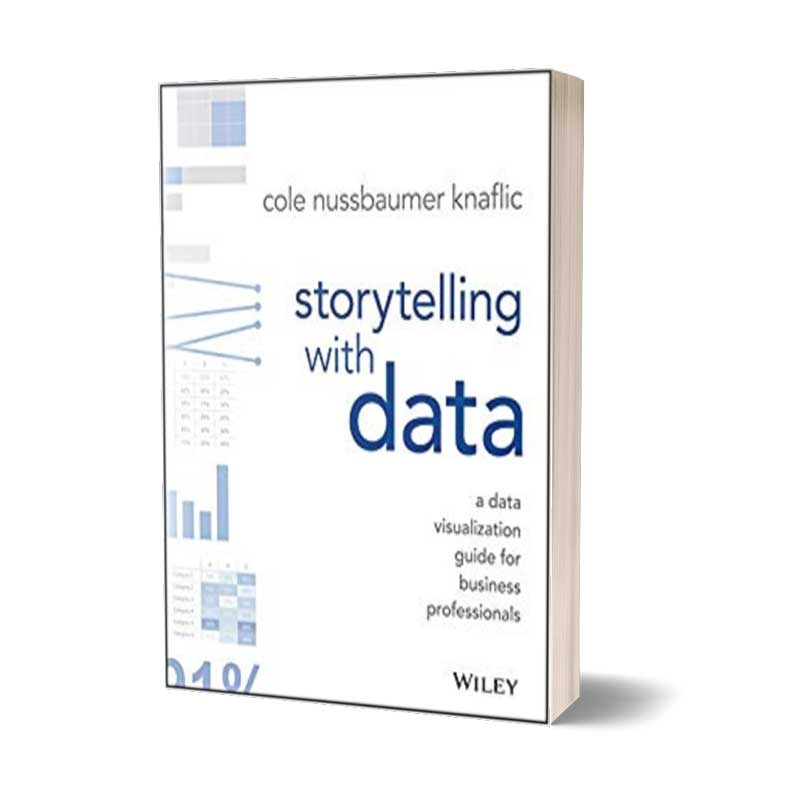
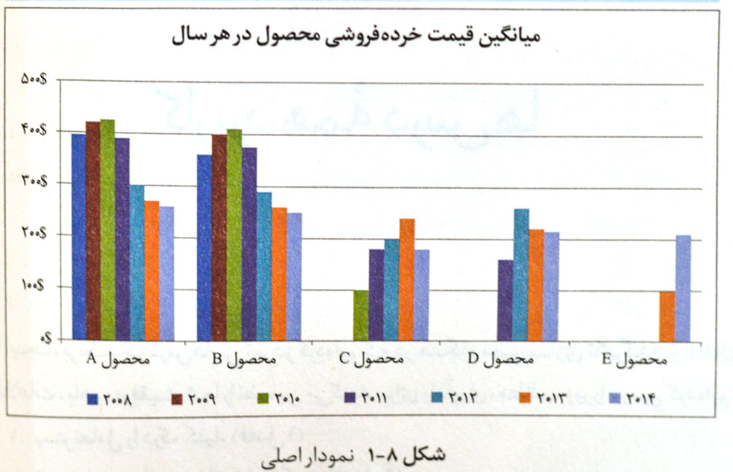

همواره نمایش داده‌ها، ارقام و اعداد و درست کردن فایل‌های ارائه و پرزنتیشن کاری سخت و زمان گیر بوده بود. ما معمولا به صورت تصادفی از تعدادی نمودار استفاده می‌کنیم بدون اینکه مطمئن باشیم آن نمودار مفهومی که می‌خواهیم را به مخاطب می‌رساند. کتاب داستان پردازی با داده به شما کمک می‌کند مخاطب را بشناسید و متناسب با مخاطب و هدف‌تان بهترین نمایش و داستان را برای داده‌هایتان آماده کنید.

اگر ده یا بیست ساعت برای گردآوری داده‌ها وقت می‌گذاریم، چرا همین‌قدر زمان (یا حتی بیشتر) را صرفِ ساختن اسلایدهایی جذاب و تأثیرگذار نکنیم؟

کول ناسبامر نافلیک (Cole Nussbaumer Knaflic) در کتاب داستان پردازی با داده ها فرض را بر این گذاشته که شما مجموعه‌ای از اعداد و ارقام را در اختیار دارید و لازم است یک ارائه‌ی بسیار قدرتمند و تأثیرگذار تهیه کنید.

از اهمیت رنگ می‌گوید، ایرادهای نمودارهای شلوغ را گوشزد می‌کند، کمک می‌کند ذهن مخاطب را به سمت پیام خود هدایت کنید و سعی می‌کند برخی از مهم‌ترین اصول طراحی را به شما یادآوری کند.

اما آیا نمودار بالا به اندازه‌ی نمودار زیر – که با فکر و تحلیل و ایده‌پردازی ترسیم شده – گویا است و پیام خود را به شکل واضح و شفاف می‌رساند؟

بنابر این پیشنهاد ما این است که «اگر ارائه‌ی نمودارها و اعداد و ارقام در فعالیت و کسب و کار شما سرنوشت‌ساز است» به سراغ این کتاب بروید: مثلاً ممکن است یک استارت آپ داشته باشید و بخواهید گزارشی تأثیرگذار به سرمایه‌گذاران خطرپذیر ارائه کنید، یا این‌که در تیم هوش تجاری (Business Intelligence) ماه‌ها زحمت کشیده‌اید و گزارش چند ماه کارتان قرار است در چند اسلاید ارائه شود.

> محتوای کتاب کمک می‌کند تا گزارشاتی که بر اساس دیتا تهیه می‌کنید هدفمند و قابل فهم برای مخاطب باشند.

پیشنهاد ما این است که سایت مکمل کتاب را از دست ندهید ([Storytellingwithdata](http://www.storytellingwithdata.com/)). در این سایت [یک وبلاگ خوب](http://www.storytellingwithdata.com/blog) و هم‌چنین [یک مجموعه پادکست ارزشمند](http://www.storytellingwithdata.com/podcast) در نظر گرفته شده که می‌تواند نکات فراوانی را به شما بیاموزد. بخش چالش‌های داستان‌پردازی با داده‌ها ([SWD Challenge](http://www.storytellingwithdata.com/swdchallenge)) هم تمرین‌ها و چالش‌هایی را در اختیار شما قرار می‌دهد تا مهارت خود را در مصورسازی داده‌ها بسنجید و بیازمایید.

## 

## خرید کتاب داستان پردازی با داده

[خرید نسخه چاپی از دیجی کالا](https://affstat.adro.co/click/0c16f374-504e-4077-8cc4-7c231e4870bc)

همچنین می‌توانید برای دانلود کتاب داستان پردازی با داده (نسخه اصلی) از بخش زیر اقدام کنید:
