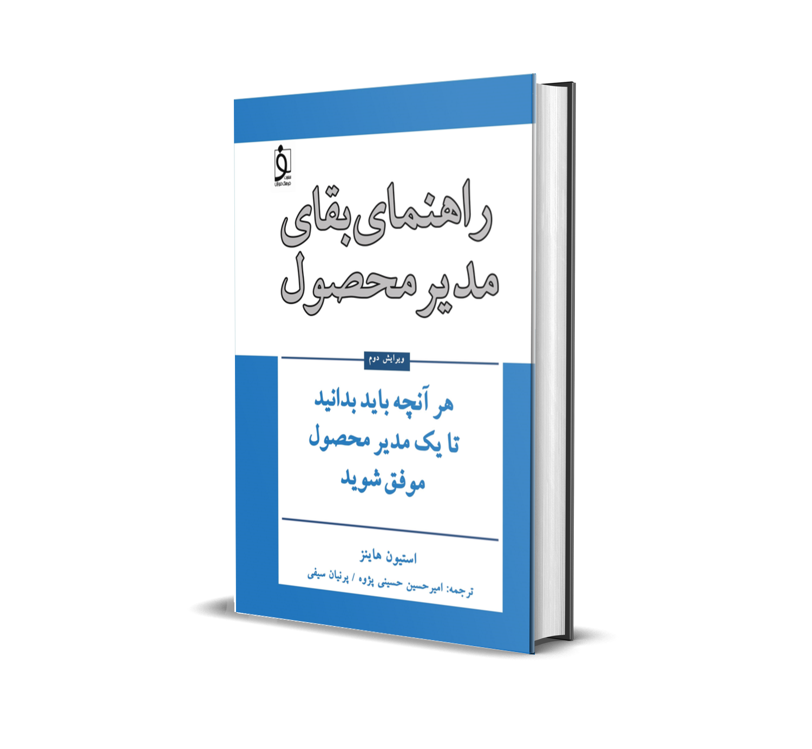

In *The Product Manager’s Survival Guide* you learn how to manage products in ambiguous organizations.

**Why this translation**

The aim of this book is to give product managers practical approaches and to explain the capabilities you need to enter the field.

**Why this book?**

Because few product-management books have been translated, and this is one of the best-known books in the field, it is expected to have a real effect on growing knowledge in this area.

**Who is this book for?**

This book offers useful, practical points for experienced product managers and for those who have just entered the field, as well as for people who want to understand product management and its responsibilities.

**What is in the book**

The book includes instructions, tips, and tools to help you do the job and to lead, influence, and stay sharp in a business environment. It also includes information that strengthens the perspective you need on your role as a product manager in any company, regardless of technology or development method.

## About the translators

### Parnian Seifi, product manager

Her first work experience as a PMO at Fanap introduced her to project-management problems and improving efficiency. She worked under the same title at Alibaba, but after the company shifted to a product-centric model she continued as a product owner. She now works more specialized at Tapsell on several products, especially in advertising. The result of her experience shows clearly in *The Product Manager’s Survival Guide*, particularly in the early, foundational chapters.

### Amirhossein Hosseini Pazhouh, product manager

He became familiar with product management after launching the Mibarim startup in 2015. The Adlift and Nobar startups were his first experience of setting up product management more properly and putting different product-development methodologies into practice. Working at Takhfifan and Alibaba gave him a better view of managing more mature products and of organizations with some complexity. The result of that experience shows clearly in *The Product Manager’s Survival Guide*, especially in the strategy chapters.

* * *

If you have trouble paying, please transfer the purchase amount to card number 6219861044637659 and send the receipt to the Telegram account amirhp.
