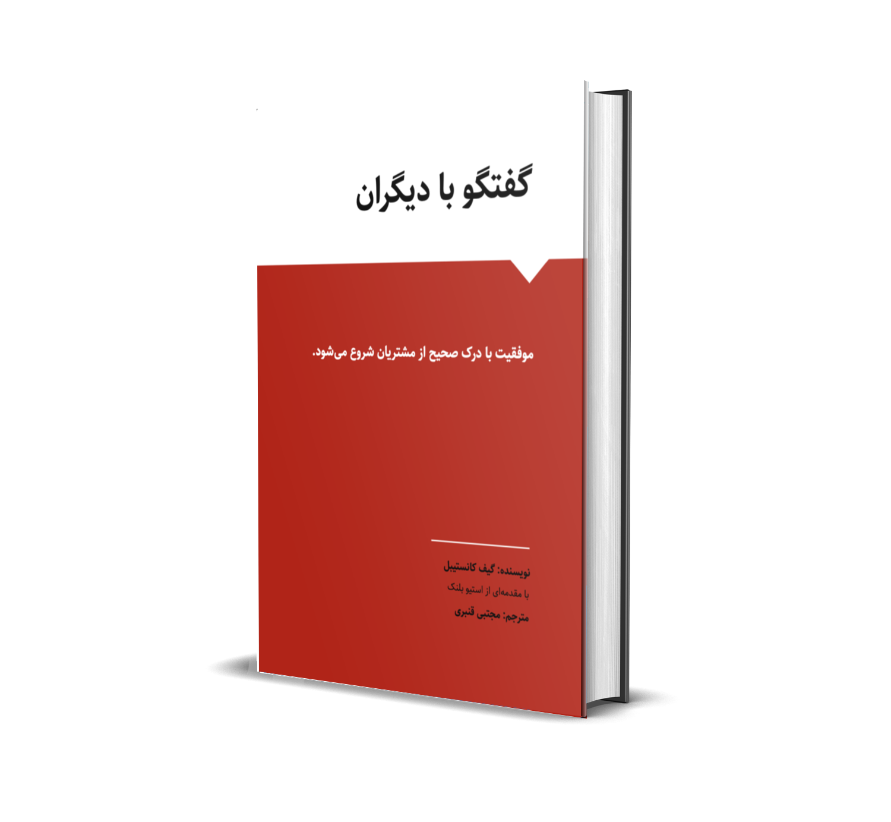

**گفتگو با دیگران** به شیوهای جامع و در عین حال مختصر و در دسترس به شما می‌آموزد که چگونه از ساختمان خارج شوید. علاقه مندان و کارآفرینان را به روش درست راهنمایی میکند: نحوه یافتن سوژه‌های مصاحبه، ساختار و نحوه انجام مصاحبه‌های مؤثر و چگونگی یادگیری خود. گیف (نویسنده کتاب) داستانها و همچنین استراتژیها، تاکتیکها و مفیدترین شیوه‌های انجام کار را ارائه میکند تا به شما کمک کند تا در مصاحبه‌های کشف مشتری خود به موفقیت برسید.

اگر دانشجو، کارآفرین مشتاق یا مدیر محصول هستید که سعی می‌کنید برای یک شرکت یا محصول ارزش ایجاد کنید، باید این کتاب را بخوانید. **گفتگو با دیگران** مملو از درسها و توصیه‌های عملی است که به شما امکان میدهد از زمان خود به بهترین شکل استفاده کنید.

**گفتگو با دیگران** مکمل کاملی برای مجموعه کارهای موجود در زمینه توسعه مشتری است. اگر در حال تدریس کارآفرینی هستید یا یک شتاب‌دهنده استارتآپی را اداره می‌کنید، باید خواندن آن را برای تیمهای خود الزامی کنید.
