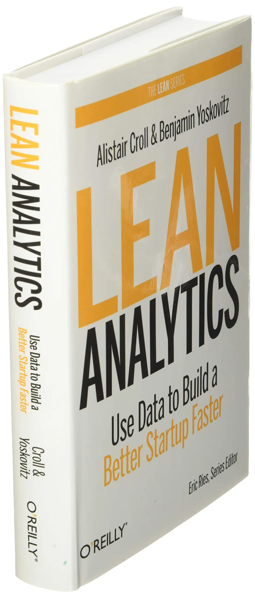

**Title: Improve business decision-making with lean analytics**

**Introduction:** In today’s business world, data plays an important role in strategic decisions. *Lean Analytics* shows you how you can use data analysis to make better decisions for growing and optimizing your business.

**A summary of *Lean Analytics*:** This book combines the principles of lean methods and data analysis, and helps businesses use their data to improve performance and grow. The authors offer a framework that helps you identify and analyze key performance indicators (KPIs).

**Key points:**

- **Identifying key metrics:** The book offers guidance for choosing the key performance indicators that matter for your business.

- **Measurement and optimization:** You learn how to collect and analyze data so you can discover useful trends and patterns and use them to improve business performance.

- **Real experiences:** The book is full of real examples from different companies that show how using data correctly can make a large difference.

**Why this book is useful:** *Lean Analytics* is a valuable resource for entrepreneurs, product managers, and startup teams looking for innovative ways to optimize and grow their business. With a data-driven approach, it enables you to make better decisions and get better results.

**Conclusion:** If you are looking for ways to use data to improve your business performance, *Lean Analytics* is a book you will not want to miss. It helps you use data as a powerful tool for business growth.
