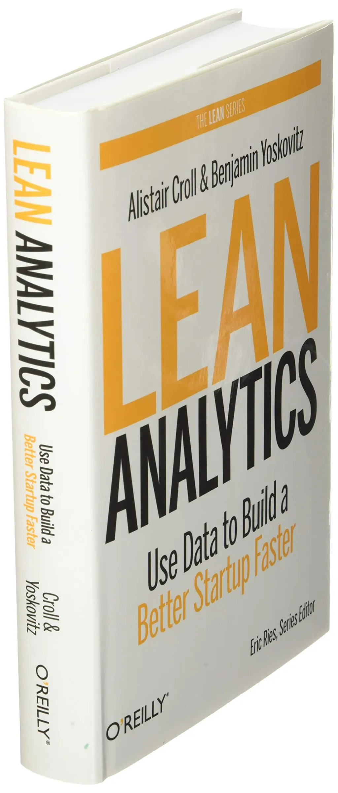

| مشخصات کتاب | توضیحات |
| :--- | :--- |
| **پدیدآور / نویسنده** | آلیستر کرول و بنجامین یوکوویتز (Alistair Croll & Benjamin Yoskovitz) |
| **حوزه تخصصی** | سنجه‌های محصول و تحلیل داده |
| **تعداد صفحات** | 440 صفحه |
| **فرمت و کیفیت** | PDF • دیجیتال استاندارد |
| **حجم فایل** | 6.9 مگابایت |
| **سطح مخاطب** | تخصصی • مدیران محصول و نوآوران |

---

**عنوان: بهبود تصمیم‌گیری کسب‌وکار با استفاده از تحلیل‌های ناب**

**مقدمه:** در دنیای کسب‌وکار امروزی، داده‌ها نقش مهمی در تصمیم‌گیری‌های استراتژیک بازی می‌کنند. کتاب "Lean Analytics" به شما نشان می‌دهد چگونه می‌توان با استفاده از تحلیل داده‌ها، تصمیم‌های بهتری برای رشد و بهینه‌سازی کسب‌وکار خود گرفت.

**خلاصه‌ای از کتاب Lean Analytics:** این کتاب، ترکیبی از اصول روش‌های ناب و تحلیل داده‌ها را ارائه می‌دهد و به کسب‌وکارها کمک می‌کند تا از داده‌های خود برای بهبود عملکرد و رشد استفاده کنند. نویسندگان، چارچوبی ارائه می‌دهند که به شما کمک می‌کند شاخص‌های کلیدی عملکرد (KPIs) را شناسایی و آنالیز کنید.

**نکات کلیدی:**

- **شناسایی شاخص‌های کلیدی:** کتاب راهنمایی‌هایی برای انتخاب شاخص‌های کلیدی عملکرد که برای کسب‌وکار شما اهمیت دارند، ارائه می‌دهد.

- **اندازه‌گیری و بهینه‌سازی:** یاد می‌گیرید چگونه داده‌ها را جمع‌آوری و تحلیل کنید تا روندها و الگوهای مفید را کشف کرده و از آن‌ها برای بهبود عملکرد کسب‌وکار استفاده کنید.

- **تجربه‌های واقعی:** کتاب پر از مثال‌های واقعی از شرکت‌های مختلف است که نشان می‌دهند چگونه استفاده صحیح از داده‌ها می‌تواند تفاوت بزرگی ایجاد کند.

**چرا این کتاب مفید است؟** "Lean Analytics" برای کارآفرینان، مدیران محصول و تیم‌های استارتاپی که به دنبال راه‌های نوآورانه برای بهینه‌سازی و رشد کسب‌وکارشان هستند، منبع ارزشمندی است. این کتاب با ارائه یک رویکرد داده‌محور، شما را قادر می‌سازد تا تصمیم‌های بهتری بگیرید و نتایج بهتری کسب کنید.

**نتیجه‌گیری:** اگر به دنبال راه‌هایی برای استفاده از داده‌ها به منظور بهبود عملکرد کسب‌وکار خود هستید، "Lean Analytics" کتابی است که نمی‌خواهید از دست بدهید. این کتاب به شما کمک می‌کند که از داده‌ها به عنوان یک ابزار قدرتمند برای رشد کسب‌وکار استفاده کنید.

---

### 📥 دریافت فایل کتاب




