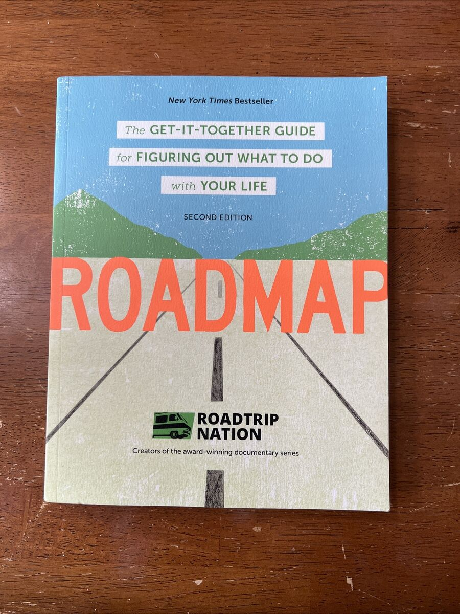

**Title: How do you find your life path with *Roadmap*?**

**Introduction:** In today’s world, which is changing at high speed, finding your life path and deciding about the future can be challenging. *Roadmap*, by Brian McAllister, helps you identify and pursue your personal and professional goals with a practical, step-by-step approach.

**A summary of *Roadmap*:** Using a systematic, stage-by-stage method, this book accompanies you on the path of discovering your interests, skills, and values. With practical examples, exercises, and a range of tools, the author helps you design your roadmap for a meaningful life.

**Key points:**

- **Identifying strengths and weaknesses:** The book helps you identify your strengths and use them to build your future path.

- **Defining realistic goals:** It teaches you how to set achievable, meaningful goals for your life.

- **Creating an action plan:** Practical methods for putting together a plan that helps you reach your goals.

**Why this book is useful:** *Roadmap* is a valuable resource for people who are still lost on their life path and are looking for a way to organize their personal and professional goals better. In simple, understandable language, it gives you the tools you need for informed decisions.

**Conclusion:** If you are looking for a comprehensive, practical guide for planning your life path, *Roadmap* can be an excellent start. By reading this book, you can look at the future with more confidence and plan for it.
