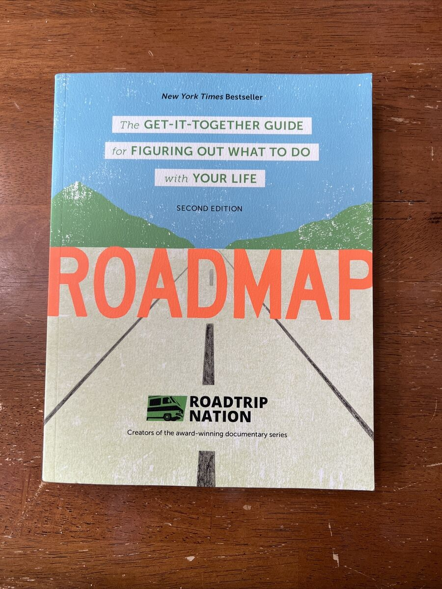

**عنوان: چگونه مسیر زندگی‌تان را با کتاب "Roadmap" پیدا کنید؟**

**مقدمه:** در دنیای امروز که با سرعت بالا در حال تغییر است، پیدا کردن مسیر زندگی و تصمیم‌گیری درباره آینده می‌تواند چالش‌برانگیز باشد. کتاب "Roadmap" نوشته‌ی برایان مک‌آلیستر به شما کمک می‌کند تا با یک رویکرد عملی و گام به گام، اهداف شخصی و حرفه‌ای خود را شناسایی و دنبال کنید.

**خلاصه‌ای از کتاب Roadmap:** این کتاب با استفاده از یک روش منظم و مرحله به مرحله، شما را در مسیر کشف علاقه‌مندی‌ها، مهارت‌ها و ارزش‌های خود همراهی می‌کند. با مثال‌های کاربردی، تمرینات و ابزارهای متنوع، نویسنده به شما کمک می‌کند تا نقشه راه خود را برای یک زندگی معنادار طراحی کنید.

**نکات کلیدی:**

- **شناسایی نقاط قوت و ضعف:** کتاب به شما کمک می‌کند که نقاط قوت خود را شناسایی کنید و از آن‌ها برای ساختن مسیر آینده استفاده کنید.

- **تعریف اهداف واقع‌بینانه:** به شما یاد می‌دهد چگونه اهداف قابل دستیابی و معنادار برای زندگی خود تعیین کنید.

- **ایجاد برنامه عملی:** روش‌های کاربردی برای تنظیم برنامه‌ای که به شما کمک می‌کند به اهداف خود برسید.

**چرا این کتاب مفید است؟** "Roadmap" برای کسانی که هنوز در مسیر زندگی‌شان سردرگم هستند و به دنبال راهی برای سازماندهی بهتر اهداف شخصی و حرفه‌ای‌شان می‌گردند، یک منبع ارزشمند است. این کتاب با یک زبان ساده و قابل فهم، ابزارهای لازم را برای تصمیم‌گیری‌های آگاهانه در اختیار شما قرار می‌دهد.

**نتیجه‌گیری:** اگر به دنبال یک راهنمای جامع و عملی برای برنامه‌ریزی مسیر زندگی‌تان هستید، کتاب "Roadmap" می‌تواند شروعی عالی باشد. با خواندن این کتاب، می‌توانید با اطمینان بیشتری به آینده نگاه کنید و برای آن برنامه‌ریزی کنید.
