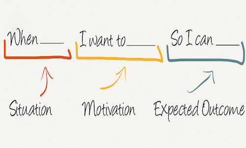
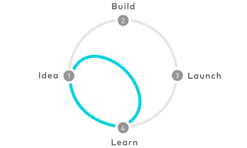

مجموعه ای از فریم ورک‌های مختلف که در زمان‌های مختلف به کمک مدیران محصول می آیند. این فریم‌ورک‌ها همگی از فریم‌ورک‌های پرکاربرد هستند که توسط مدیران محصول با تجربه طراحی شده و مورد استفاده قرار گرفته اند. اگر شما هم فریم‌ورک مخصوص به خود را دارید با ما در میان بگذارید.

[Jobs To Be Done](/jobs-to-be-done/)

[دیزاین اسپرینت](/design-sprint/)

[بررسی فرصت‌های محصول](/assessing-product-opportunities/)
