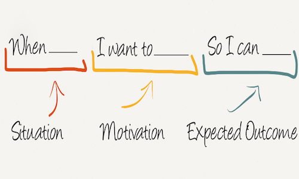

کاری که باید انجام شود، یا JTBD، به پیشرفتی اشاره دارد که یک شخص امیدوار است در زندگی خود ایجاد کند. "job" چیزی است که شخص واقعا در حال تلاش برای انجام آن در یک وضعیت خاص است. بطور خلاصه بخواهم بگویم این فریمورک به دنبال این است که بگوید یک کاربر از محصول شما برای انجام یک کار خاص یا رفع نیاز خود یا رسیدن به هدف خاص خود استفاده میکند نه به خاطر شیوه‌ای که شما در اختیار وی قرار می دهید. درواقع بایستی بتوانید هدف استفاده از محصول خود را در کاربران خود بیابید.

ایده این است که مردم محصولات یا خدمات را برای انجام کاری خاص در زندگی خود استخدام می کنند. پس از آن وظیفه مدیر محصول و مدیر بازاریابی است، تا متوجه شود چه کاری برای مشتری انجام می دهد و چگونه می توانند پیشنهاد خود را برای پاسخگویی به این نیاز ها ارائه دهند.

یک job فراتر از انجام یک کارکرد عملی است. اغلب یک عنصر اجتماعی یا عاطفی برای یک job وجود دارد که دلیل انتخاب یک محصول در مقابل دیگر محصولات می‌شود.

مطالعه بیشتر: [شناخت بهتر مشتری با فریمورک JTBD](https://hbr.org/2016/09/know-your-customers-jobs-to-be-done?ref=https://product-frameworks.com)
