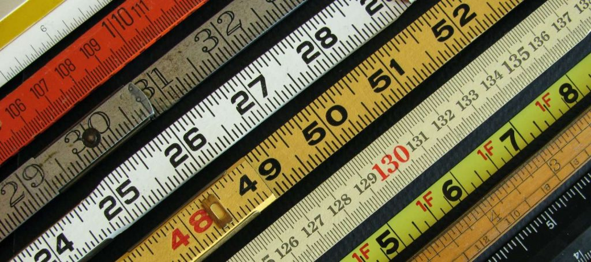

## Product management foundations

#### What you will learn

You will learn product management foundations across every area, including the skills.

You will learn who a product manager is and, in general, how to be a good one.

#### 5 articles

- [Product management and an introduction to the duties and skills it requires](/en/docs/archive/intro-for-product-managment/)

- [Seven simple but smart skills for mastering the product manager role](/en/docs/archive/7-skills-for-product-management/)

- [Know the good product manager and the bad product manager](/en/docs/archive/good-bad-product-manager/)

- [Sample product manager interview questions at different companies](/en/docs/archive/sample-question/)

- [Being technical enough as a product manager](/en/docs/archive/being-technical-enough-as-a-product-manager/)

## Building the product

#### What you will learn

You will learn product management foundations across every area, including the skills.

You will learn who a product manager is and, in general, how to be a good one.

#### 2 articles

- [Building a product from zero to one hundred in only 4 steps](/en/docs/archive/4-step-to-produce-product/)

- [Product roadmap and product backlog — similarities and differences](/en/docs/archive/roadmap-backlog/)

## The customer

#### What you will learn

The customer is the foundation of product management and needs particular attention and care.

You will learn how to manage the customer.

#### 1 article

- [Customer development for product managers](/en/docs/archive/customer-development/)

In recent years, product management training has been one of the most important courses in product and IT-based production. But what should you do for free product management learning? Follow this path with us.

## Discovering product strategy

## What you will learn

Before you start building a product, or take over managing one, you need to define your product strategy. What is your position? Which part of the market are you targeting? What is strategy, anyway?

## 4 articles

- [Strategy is not a list of things to do!](/en/docs/archive/strategy-isnt-todo/)
- [What does good product strategy look like? + a Snapp case study](/en/docs/archive/good-product-strategy/)
    
- [What is product positioning? + a Basecamp case study](/en/docs/archive/product-positioning/)
    
- [Navigating the product maze + a practical product-navigation guide](/en/docs/archive/navigation-product/)
    

## Improving soft skills

## What you will learn

A product manager needs to bring people from different parts of the organization along.

To do that you need non-specialist skills that still matter a great deal.

## 4 articles

- [Negotiating with stakeholders: the best advice for product managers](/en/docs/archive/top-tips-negotiating-stakeholders/)
- [Workplace politics: why you should practice politics at work](/en/docs/archive/workplace-politics/)
    
- [The best teams hold themselves accountable](/en/docs/archive/the-best-teams-hold-themselves-accountable/).
    
- [Active listening: the key for product managers to communicate well](/en/docs/archive/authentic-listening/)
    

## The professional product manager

## What you will learn

When you become professional at product management, you can bring new cultures and ideas into your organization and team and take the quality of your work up a level.

## 4 articles

- [What I learned from 100 JTBD interviews: why users switch](/en/docs/archive/jobs-to-be-done-100interview/).
    
- [Working backwards: how to reach your goals with the minimum technology you need](/en/docs/archive/backward-working/).
    
- [What is user story mapping and how do you do it?](/en/docs/archive/userstory-mapping/)
    
- [How should you run a product brainstorm?](/en/docs/archive/product-brain-storming/)
    

## Product evaluation

## What you will learn

Measurement is one of the foundations of working on a product.

You will learn how to evaluate and how to measure.

## 2 articles

- [How should a product team be evaluated?](/en/docs/archive/product-team-performance/)
    
-  [How do product metrics help in product management?](/en/docs/archive/product-metrics/)
