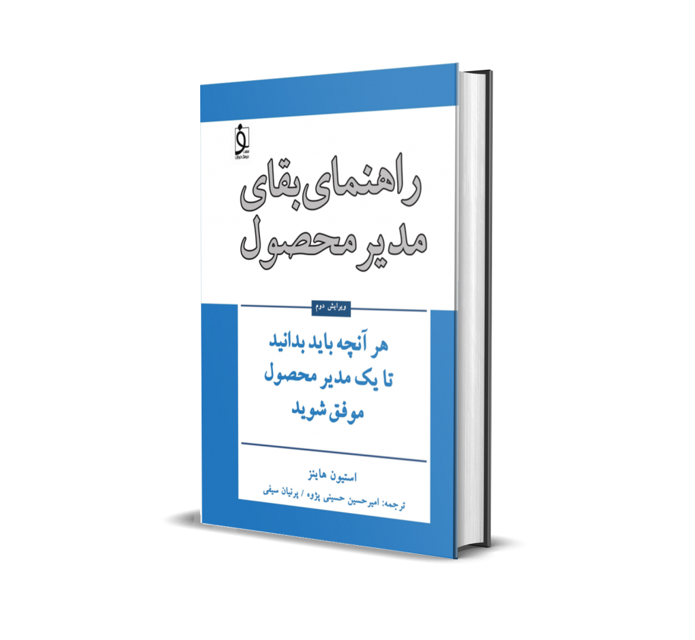
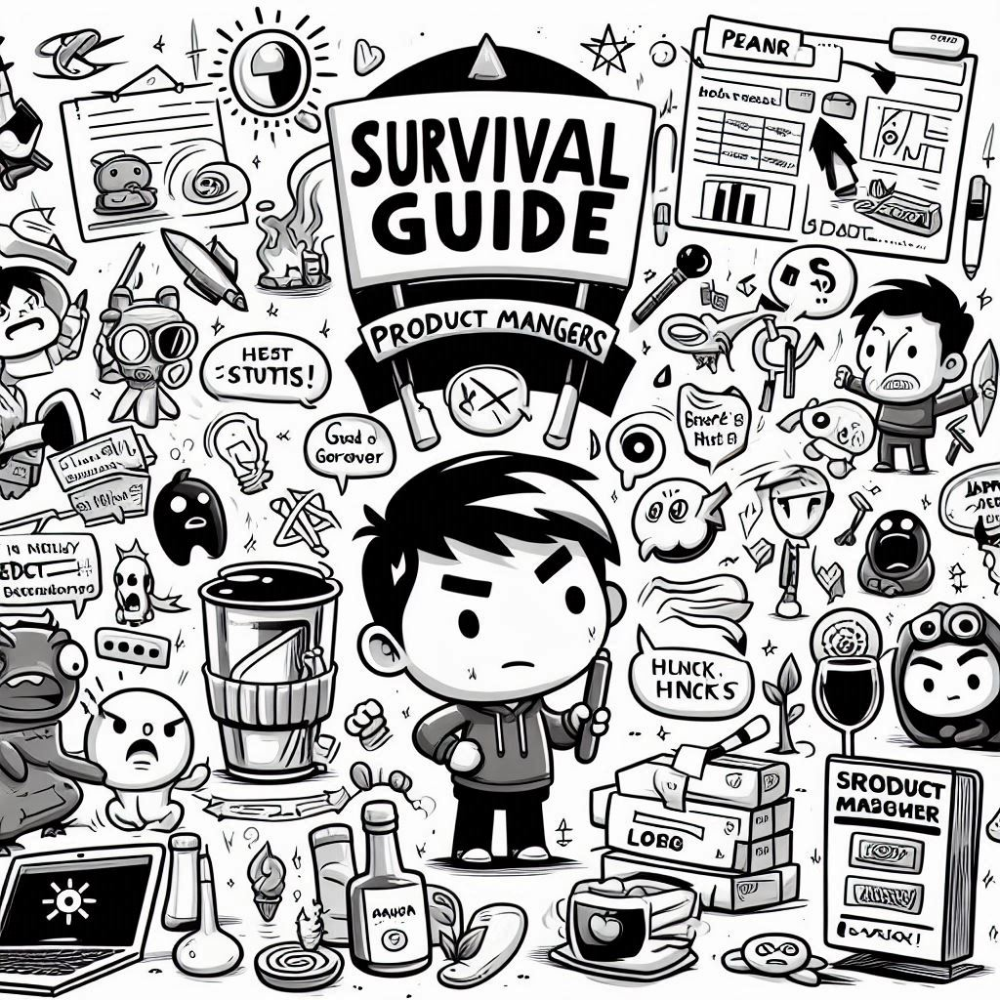

[کتاب‌های بیشتر](https://theminiceo.ir/downloads/category/%da%a9%d8%aa%d8%a7%d8%a8/)

## دوره‌های آموزشی آنلاین و کم هزینه مناسب همه!

[دوره راهنمای بقای مدیر محصول](https://theminiceo.ir/product-managment-course/)

[دوره سیاست و رشد در محل کار](https://theminiceo.ir/course/policy-and-growth-in-work/)

[مدیریت محصول برای برنامه‌نویسان و توسعه دهندگان](https://theminiceo.ir/course/product-managment-for-developers/)

[مدیریت محصول برای کسب و کارهای خانگی](https://theminiceo.ir/course/product-for-home-business/)

[مدیریت محصول سنتی و آفلاین](https://theminiceo.ir/course/product-managment-for-traditional-business/)

[هوش مصنوعی برای مدیران محصول](https://theminiceo.ir/course/ai-for-pms/)

* * *

## محصول ایده‌آل را بسازید

مدیرعامل کوچک جاییست که در آن همه می‌توانند مدیر محصول شوند و محصول خودشان را مدیریت کنند. تفاوتی ندارد چه تخصصی دارید و محصولتان چقدر بزرگ است.

برای یادگیری ساخت محصول، شرکت در [دوره‌های آموزشی](https://theminiceo.ir/course/survival-guide-for-pm/)، دسترسی به [کتاب‌های کسب و کار](https://theminiceo.ir/downloads/category/%da%a9%d8%aa%d8%a7%d8%a8/) و [دریافت مشاوره](https://theminiceo.ir/product-consultant/) از بهترین‌های حوزه محصول است.

کافیست در انبوه مقالاتی که توسط تیم TMC نوشته شده است غرق شوید در دوره‌ها شرکت کنید و هر سوالی که داشتید از ما بپرسید.

با مدیر عامل کوچک (TMC) یاد بگیرید، مشاوره بگیرید و تجربه کسب کنید تا محصول سازمان خود را ارتقا دهید یا با کمترین هزینه کسب و کار و محصول جدید خود را راه اندازی کنید. ما کمک می‌کنیم مدیر محصول شوید و همان چیزی را بسازید که مشتری می‌خواهد. 

[درخواست مشاوره](http://t.me/amirhp)

## مقالات متخصصین

مدیرعامل کوچک جایی برای یادگیری و اشتراک تجربه است. اگر در حوزه محصول و استارتاپ و یا سازمان تجربه‌ای دارید می‌توانید آن را برای ما ارسال کنید تا به اسم خودتان منتشر شود. 

[ارسال مقاله](mailto:hi@theminiceo.ir)

یادگیری رایگان مدیریت محصول

### درباره مدیرعامل کوچک (TheMiniCEO (TMC

«**مدیرعامل کوچک**» محلی برای اشتراک دانش درباره چیزهایی است که به مرور درباره مدیریت محصول یاد گرفته‌ایم. از آنجایی که مدیریت محصول بیش از اینکه دانش باشد در چرخه تجربه و بر بستر سازمان و ارتباطات ما شکل می‌گیرد، اشتراک تجربیات در درک بهتر شرایط مختلف و تصمیم گیری موثرتر کمک می‌کند.

مدیرعامل کوچک، جامعه‌ای از مدیران محصول است تا فرآیند تولید و توسعه محصولات را ارتقا دهد. 

### جامعه‌ای از مدیران محصول

در انجمن مدیران محصول می‌توانید سوال‌های خود را بپرسید و از تجربه بهترین افراد در زمینه مدیریت محصول برای حل مسائل خود بهره ببرید.

جایی برای یادگیری، اشتراک و دریافت مشورت برای ساختن بهترین محصولات و شرکت‌های استارتاپی. 

### مشاوره با بهترین‌ها

کارکشته‌ترین مدیران محصول آماده هستند تا برای پیشبرد محصول شما را راهنمایی کنند و در صورتی که در مرحله‌ای از کار دچار چالش شده‌اید شما را از شرایط بحرانی و مبهم بیرون بیاورند.

### برترین مقالات مدیریت محصول

مدیریت محصول علمی میان رشته‌ای و وسیع درباره بهینه‌سازی و ساخت محصولات مختلف است. مطالعه مقالات نوشته شده در این زمینه دید وسیعی به شما می‌دهد.

## به دنبال چه موضوعی هستید؟

  

